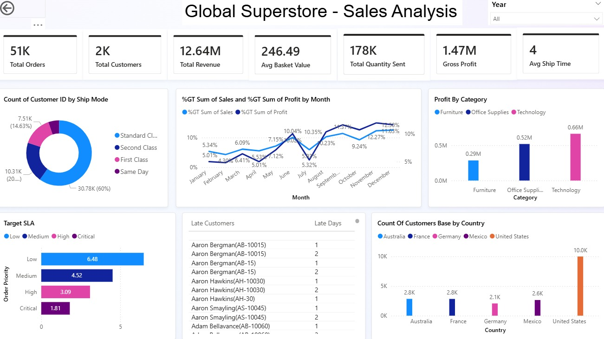
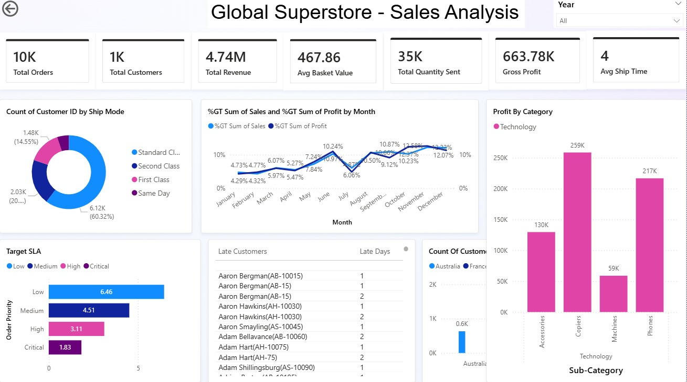
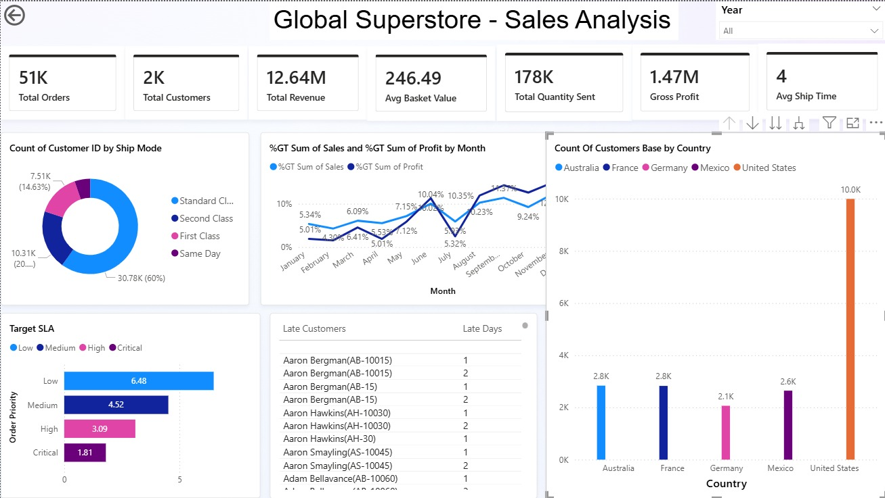
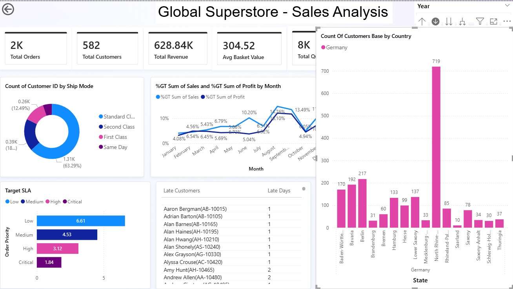
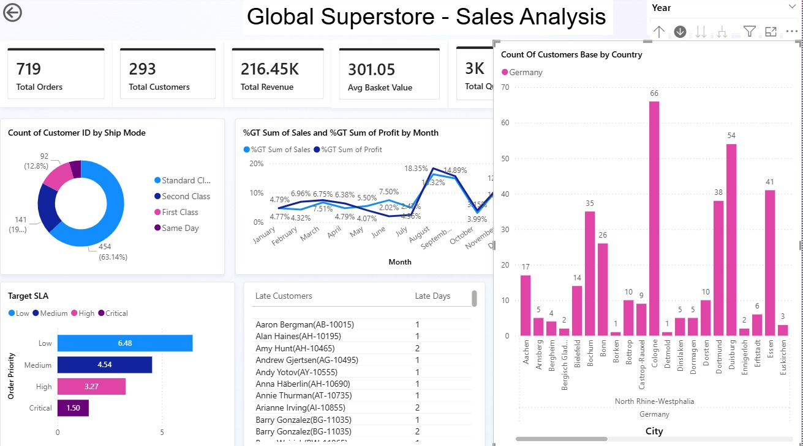

# Global Superstore – Sales Analysis Dashboard

## Overview
This project presents an interactive **Sales Performance Dashboard** built using the *Global Superstore* dataset.  
The dashboard provides a comprehensive view of **sales, profitability, customer behavior, shipping performance, and regional distribution** across multiple years.

It is designed to support **business decision-making** by highlighting trends, operational efficiency, and revenue-driving segments.

---

## Key Performance Indicators (KPIs)

### Total Orders
Represents the total number of orders placed during the selected time period.  
Helps measure overall sales activity and demand.

### Total Customers
Shows the count of unique customers.  
Useful for understanding customer base growth and retention.

### Total Revenue
Indicates the total sales value generated.  
This is a primary metric to evaluate business performance.

### Average Basket Value
Calculated as:
```
Total Revenue ÷ Total Orders
```
Helps understand customer purchasing behavior and order size.

### Total Quantity Sent
Displays the total number of items shipped.  
Useful for logistics planning and inventory management.

### Gross Profit
Represents total profit after costs.  
Critical for evaluating business sustainability and product performance.

### Average Shipping Time
Shows the average number of days taken to deliver orders.  
Used to assess operational efficiency and service quality.

---

## Visualizations Breakdown

### 1. Customer Distribution by Ship Mode (Donut Chart)
Displays the proportion of customers using:
- Standard Class  
- Second Class  
- First Class  
- Same Day  

**Insight:**  
Helps identify preferred shipping methods and evaluate customer cost vs speed preferences.

---

### 2. Monthly Sales & Profit Contribution (%GT Line Chart)
Shows:
- Percentage contribution of **Sales**
- Percentage contribution of **Profit**
for each month.

**Insight:**  
Identifies seasonality, peak sales months, and periods of higher profitability.

---

### 3. Profit by Category (Bar Chart)
Breaks down profit across:
- Furniture  
- Office Supplies  
- Technology  

**Insight:**  
Helps determine which product categories drive the most profit and where optimization is required.

---

### 4. Technology Profit by Sub-Category (Bar Chart)
Further drills down Technology into:
- Accessories  
- Copiers  
- Machines  
- Phones  

**Insight:**  
Highlights high-margin sub-categories and underperforming products.

---

### 5. Target SLA vs Order Priority (Horizontal Bar Chart)
Shows SLA performance across priority levels:
- Low  
- Medium  
- High  
- Critical  

**Insight:**  
Used to evaluate whether high-priority orders are being serviced within acceptable timelines.

---

### 6. Late Customers & Late Days (Table)
Lists customers whose orders were delivered late along with the number of delay days.

**Insight:**  
Helps identify repeat SLA violations and customers affected by delivery delays.

---

### 7. Customer Base by Country (Bar Chart)
Displays customer count by country, including:
- United States  
- Australia  
- France  
- Germany  
- Mexico  

**Insight:**  
Identifies key markets and regional demand distribution.

---

### 8. Customer Distribution by State (Germany – Drill Down)
Provides a deeper regional analysis within Germany at the **state level**.

**Insight:**  
Supports localized marketing, logistics planning, and regional strategy decisions.

---

### 9. Customer Distribution by City (Germany – Drill Down)
Further drill-down to the **city level** for granular insights.

**Insight:**  
Helps identify high-density customer hubs and potential growth areas.

---

## Year Filter Functionality
The dashboard supports **dynamic year filtering**, allowing analysis across individual years (2011–2014) or all years combined.

**Insight:**  
Enables year-over-year performance comparison and trend analysis.

---

## Tools & Technologies Used
- Power BI (Data Modeling & Visualization)
- DAX (Calculated Measures & KPIs)
- PowerQuery
- Global Superstore Dataset (images/https://www.kaggle.com/datasets/apoorvaappz/global-super-store-dataset)

---

## Business Value
This dashboard enables stakeholders to:
- Track sales and profit trends
- Identify high-performing products and regions
- Monitor delivery performance and SLA compliance
- Make data-driven operational and strategic decisions
